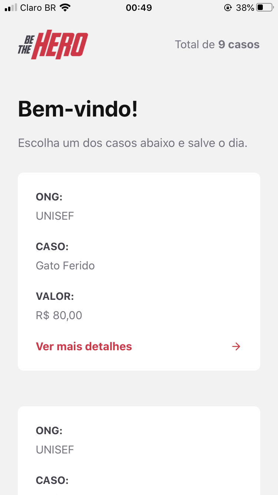
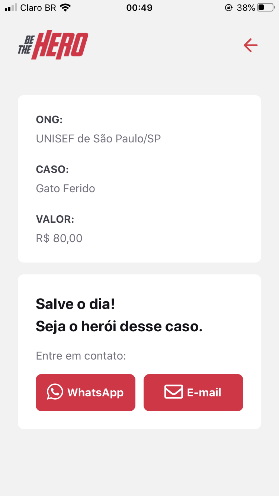
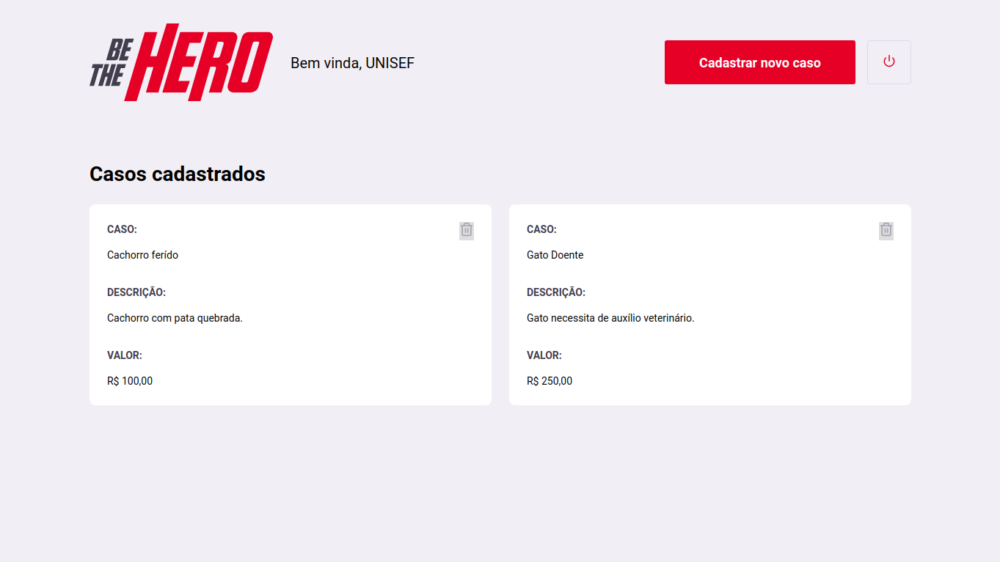
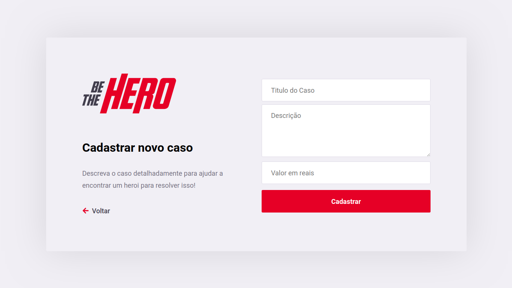
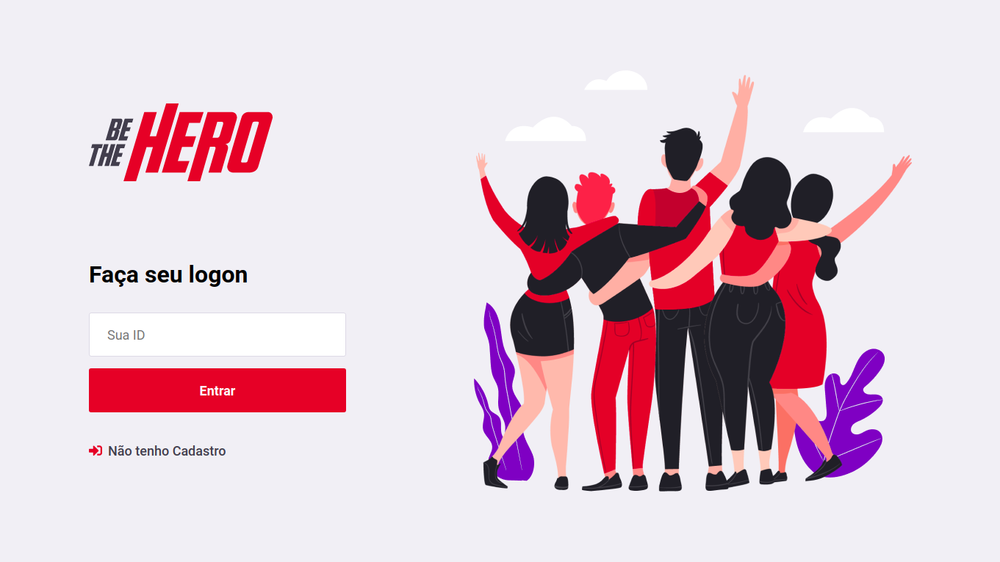

<h1 align="center">
  
</h1>

<h3 align="center">
  O Be The Hero é um projeto resultado da Semana Omnistack 11. Essa aplicação foi construida utilizando NodeJS, ReactJS e React Native. O Be The Hero trata-se de uma aplicação cujo o objetivo é para que ONG's possam cadastrar casos para que pessoas possam viar a se solidariazar com o caso e ajudar contribuindo.
</h3>

---

<h3 align="center">
  ⚠️ Para cada uma das pastas(backend, frontend, mobile) existentes nesse repo, existe uma documentação específica dentro de cada uma. ⚠️
</h3>

---

<h1>
  <a href="https://github.com/tavareshenrique/be-the-hero/tree/master/backend" style="text-decoration: none;" >
  💾 Back-End (NodeJS) ✅
  </a>
</h1>

<h1>
   <a href="https://github.com/tavareshenrique/be-the-hero/tree/master/frontend" style="text-decoration: none;">
  ⚛️ Front-End (ReactJS) ✅
  </a>
</h1>

<h1>
  <a href="https://github.com/tavareshenrique/be-the-hero/tree/master/mobile" style="text-decoration: none;">
  📱 Mobile (React Native) ✅
  </a>
</h1>

---

<h1>Imagens</h1>

---

<h1 align="center">
  
  
</h1>

<h1 align="center">
  
  

</h1>

<h1 align="center">
  
</h1>

---

## Autor

<table>
  <tr>
    <td align="center">
      <a href="http://github.com/tavareshenrique/">
        
         
        
          <b>Henrique Tavares</b>
        
       </a>
        
       <a href="https://github.com/tavareshenrique/be-the-hero/commits?author=tavareshenrique" title="Code">@tavareshenrique</a>
    </td>
  </tr>
</table>

## Licença

Este projeto está licenciado sob a licença MIT - consulte o arquivo [LICENSE.md](https://github.com/tavareshenrique/be-the-hero/blob/master/LICENSE) para obter detalhes.
