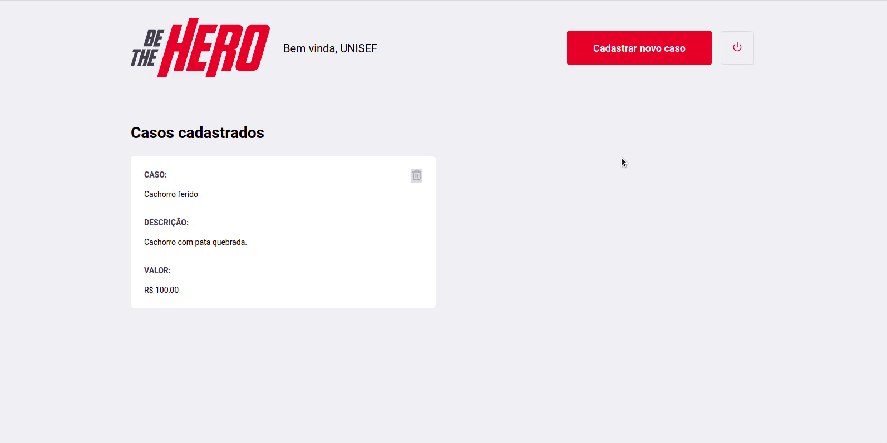

<h1 align="center">
  
</h1>

<h3 align="center">
  O Be The Hero é um projeto resultado da Semana Omnistack 11. Essa aplicação foi construida utilizando ReactJS. O Be The Hero trata-se de uma aplicação cujo o objetivo é para que ONG's possam cadastrar casos para que pessoas possam viar a se solidariazar com o caso e ajudar contribuindo.
</h3>

---


---


---



## Instalando e Executando

Clone o repositório:

```
git clone https://github.com/tavareshenrique/be-the-hero.git
```

Acesse a pasta frontend, em seu terminal digite:

```
cd frontend
```

Instale as dependencias

```
yarn
```

ou

```
npm install
```

Execute o Back-End do Be The Hero antes de iniciar o Front-End

```
https://github.com/tavareshenrique/be-the-hero/tree/master/backend
```

ou

```
cd backend
```

```
yarn && yarn dev
```

Execute o Front-End do Be The Hero

```
yarn start
```

ou

```
npm start
```

## Construído com

- [ReactJS](https://pt-br.reactjs.org/)
- [React Hooks](https://pt-br.reactjs.org/docs/hooks-intro.html)
- [Rocketseat/Unform](https://github.com/Rocketseat/unform)
- [Axios](https://github.com/axios/axios)
- [Prop-Types](https://www.npmjs.com/package/prop-types)
- [React Alert](https://github.com/schiehll/react-alert#readme)
- [React Helmet](https://github.com/nfl/react-helmet)
- [React Icons](https://react-icons.netlify.com/#/)
- [React Router DOM](https://reacttraining.com/react-router/web)
- [React Toastify](https://github.com/fkhadra/react-toastify)
- [Reactotron](https://github.com/infinitered/reactotron)
- [Styled Components](https://www.styled-components.com/)
- [ESLint](https://eslint.org/)
- [Prettier](https://prettier.io/)
- [React App Rewired](https://github.com/timarney/react-app-rewired)

## Author

<table>
  <tr>
    <td align="center">
      <a href="http://github.com/tavareshenrique/">
        
        <br />
        <sub>
          <b>Henrique Tavares</b>
        </sub>
       </a>
       <br />
       <a href="https://github.com/tavareshenrique/be-the-hero/commits?author=tavareshenrique" title="Code">@tavareshenrique</a>
    </td>
  </tr>
</table>

## Licença

Este projeto está licenciado sob a licença MIT - consulte o arquivo [LICENSE.md](https://github.com/tavareshenrique/be-the-hero/blob/master/frontend/LICENSE.md) para obter detalhes.
